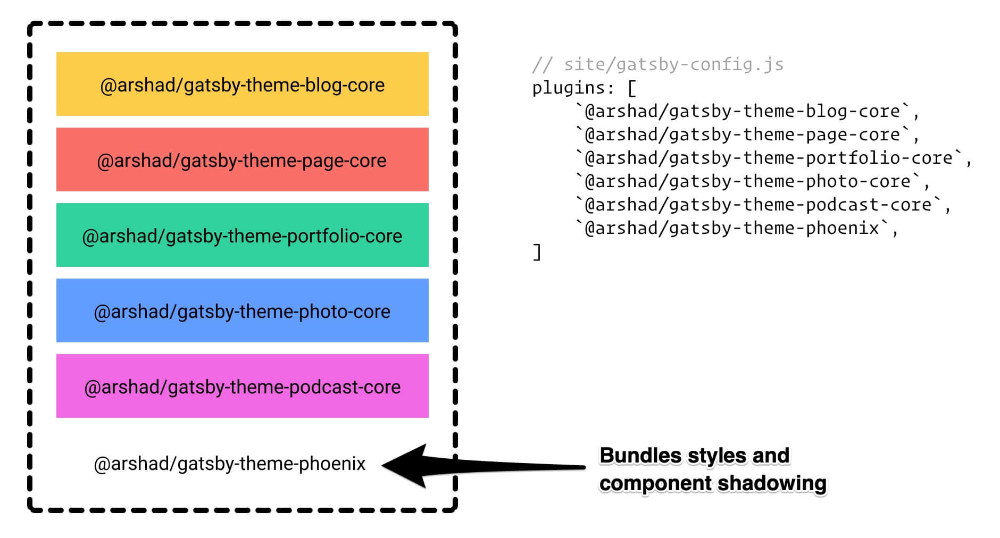

<div align="center">

<h1>@arshad/gatsby-themes</h1>
</div>

<p align="center">
A collection of <strong>open source</strong>, <strong>well designed</strong>, <strong>highly customizable</strong> and <strong>100% free</strong> Gatsby themes for <em>blazing fast sites</em>.
</p>

<p align="center">
  <a href="https://github.com/arshad/gatsby-themes/blob/master/LICENSE"></a>
  <a href="https://github.com/arshad/gatsby-themes/pulls"></a>
  <a href="https://twitter.com/arshadcn"></a>
</p>

## Themes

### 1. Phoenix

<p>
<a href="https://arshad-gatsby-example-phoenix.netlify.com"></a>
<a href="https://www.npmjs.com/package/@arshad/gatsby-theme-phoenix"></a>
</p>

<p>A Gatsby theme that bundles a <strong>blog, portfolio, photography</strong> and <strong>podcast</strong>. It uses <strong>Tailwind CSS</strong> for theming and includes <strong>code highlighting with Prism, RSS feed, a dark mode</strong> and <strong>great typography</strong>.</p>


## Architecture

All included themes are composed themes, which means they make use of multiple core themes for core types and a child theme for styles and [latent component shadowing](https://johno.com/latent-component-shadowing). This architecture allows themes to be flexible and customizable.

The following diagram shows an example of theme composition for @arshad/gatsby-theme-phoenix.



As you can see, you can easily swap `@arshad/gatsby-theme-phoenix` with your own theme and styles, keeping all functionality unchanged.

## Core themes

The following core themes are available. They bundle core types and functionality. They include **no styles** and are meant to be **consumed by other themes or sites**. Use them to compose and build your own themes.

To learn more about theme composition, check out the [official docs](https://www.gatsbyjs.org/docs/themes/theme-composition/).

| Name                                                                                                                          | Version                                                                                                                                                                        | Description                                                                                                                          |
| ----------------------------------------------------------------------------------------------------------------------------- | ------------------------------------------------------------------------------------------------------------------------------------------------------------------------------ | ------------------------------------------------------------------------------------------------------------------------------------ |
| [`@arshad/gatsby-theme-core` ](https://github.com/arshad/gatsby-themes/tree/master/core/gatsby-theme-core)                    | <a href="https://www.npmjs.com/package/@arshad/gatsby-theme-core"></a>                | Shared types and helpers for @arshad/gatsby-themes                                                                                   |
| [`@arshad/gatsby-theme-blog-core`](https://github.com/arshad/gatsby-themes/tree/master/core/gatsby-theme-blog-core)           | <a href="https://www.npmjs.com/package/@arshad/gatsby-theme-blog-core"></a>           | Adds a `Post` type that you can use to build a blog. Includes post excerpt, featured image, tags/categories and paginated pages.     |
| [`@arshad/gatsby-theme-page-core`](https://github.com/arshad/gatsby-themes/tree/master/core/gatsby-theme-page-core)           | <a href="https://www.npmjs.com/package/@arshad/gatsby-theme-page-core"></a>           | Adds a `Page` type with MDX support. Includes code highlighting with prismjs.                                                        |
| [`@arshad/gatsby-theme-photo-core`](https://github.com/arshad/gatsby-themes/tree/master/core/gatsby-theme-photo-core)         | <a href="https://www.npmjs.com/package/@arshad/gatsby-theme-photo-core"></a>         | Adds a `Photo` type that you can use to build a photography site.                                                                    |
| [`@arshad/gatsby-theme-podcast-core`](https://github.com/arshad/gatsby-themes/tree/master/core/gatsby-theme-podcast-core)     | <a href="https://www.npmjs.com/package/@arshad/gatsby-theme-podcast-core"></a>     | Adds a `Podcast` and `PodcastEpisode` types that you can use to build a podcast site. Podcast episodes are pulled from podcast feed. |
| [`@arshad/gatsby-theme-portfolio-core`](https://github.com/arshad/gatsby-themes/tree/master/core/gatsby-theme-portfolio-core) | <a href="https://www.npmjs.com/package/@arshad/gatsby-theme-portfolio-core"></a> | Adds a `Project` types that you can use to build a portfolio site.                                                                   |

Click on the theme page to learn more about the core theme and how to use it.

## Usage

[Browse our free themes](https://github.com/arshad/gatsby-themes/tree/master/themes) or create your own. You can mix and match core themes to compose your Gatsby site.

### Example

To build a portfolio site with a blog, run the following command in your site.

```shell
yarn add @arshad/gatsby-theme-portfolio-core @arshad/gatsby-theme-blog-core
```

Then enable the themes in your `gatsby-config.js`

```js
// gatsby-config.js
...
  plugins: [
    `@arshad/gatsby-theme-blog-core`,
    `@arshad/gatsby-theme-portfolio-core`
  ]
...
```

To disable a core theme, run `yarn remove @arshad/gatsby-theme-name` and then remove it from your `gatsby-config.js` file.

## Support

Need help? Create an issue on the main repo [@arshad/gatsby-themes](https://github.com/arshad/gatsby-themes/issues) or ask me [@arshadcn](https://twitter.com/arshadcn).

## License

<a href="https://www.npmjs.com/package/@arshad/gatsby-theme-phoenix"></a>
